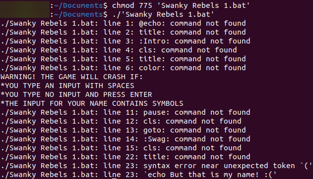

# Swanky Rebels

This is one of my first projects of all time. It consists of two text-adventure games I made using the Windows Batch language.

In order to run this on Unix operating systems, download [Wine](https://www.winehq.org/ "Download Wine from www.winehq.org") to have access to commands from Windows.

If you run this on a Unix operating system without Wine, this is what happens:

## Credits

Alex Akoopie - Creator